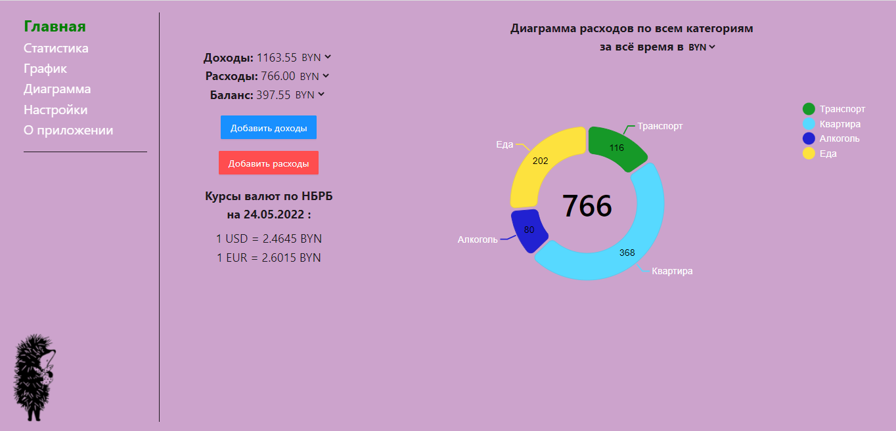
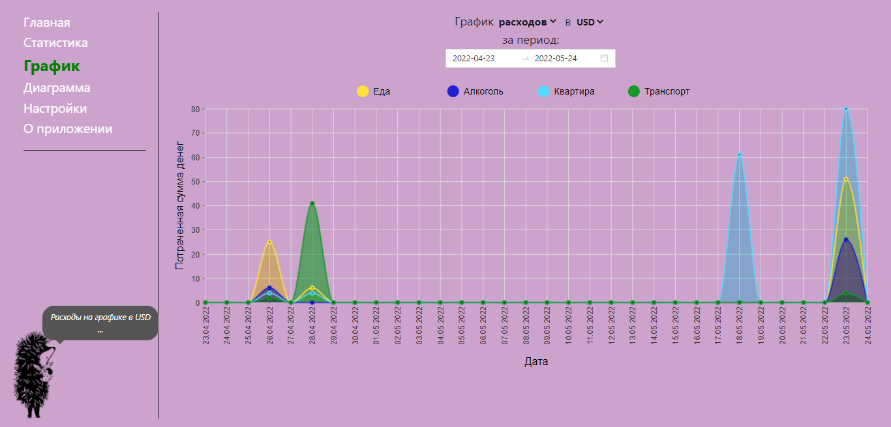

<h1>Веб-приложение учета расходов и доходов.</h1>
<h2>Приложение предназначено для учета Ваших доходов и расходов, 
    а также для подробного отображения статистики по ним. 
    Вся информация представлена в виде таблиц, диаграмм, графиков 
    для удобства просмотра и анализа доходов и расходов за разные периоды времени.</h2>
    

        
        
    

<h2>При разработке клиентской части приложения использовались:</h2>
<ul>
    <li>React - для создания приложения</li>
    <li>Redux - для управления состоянием приложения</li>
    <li>Axios - для работы с сетевыми запросами</li>
    <li>React Router - для навигации внутри приложения</li>
    <li>Ant Design - для визуального оформления</li>
    <li>Nivo - для работы с диаграммами и графиками</li>
</ul>
<h2>Серверная часть приложения <a href="https://github.com/Asnaeb26/expenses">GitHub/Python</a></h2>
